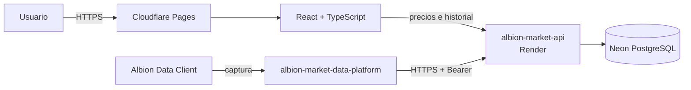
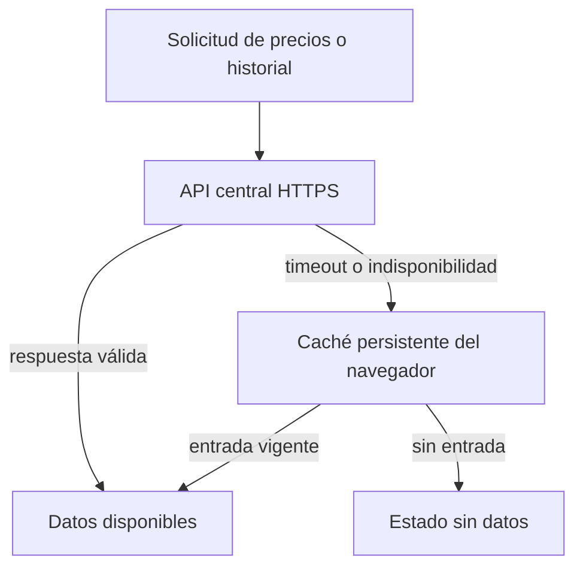
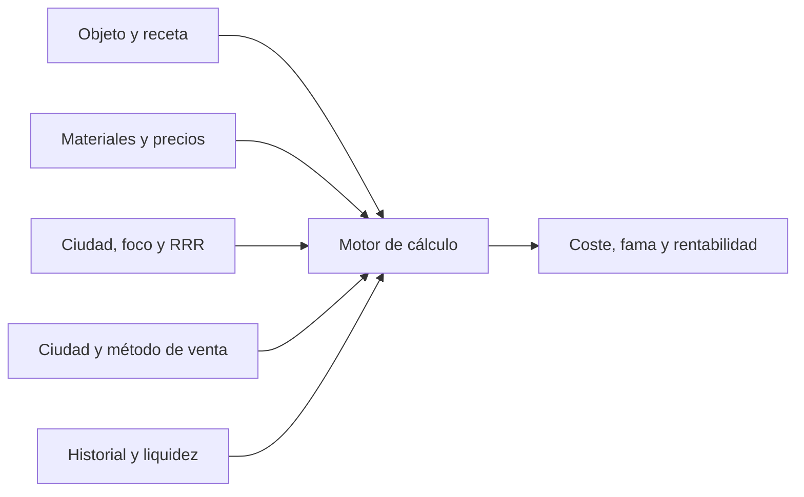

<div align="center">

# Albion Production Calculator

**Aplicación web de crafteo, refinamiento y análisis económico para Albion Online.**

[Aplicación pública](https://albion-production-calculator.pages.dev) · [Documentación](docs/) · [API de mercado](https://albion-market-api.onrender.com/api/v1)


</div>

---

Albion Production Calculator reúne cálculo de costes, retorno de recursos, tarifas, fama, precios actuales, historial y liquidez en una interfaz orientada a decisiones de producción. La aplicación pública consume la API central alojada en Render y mantiene una caché persistente para degradación controlada.

> [!NOTE]
> El usuario final solo necesita abrir la aplicación web. Albion Data Client y el receiver local pertenecen al flujo de recolección de datos, no al uso normal de la calculadora.

## Papel dentro de la plataforma

| Área | Responsabilidad |
|---|---|
| Cálculo | Costes, retorno, impuestos, tarifas, foco y rentabilidad |
| Mercado | Precios actuales, historial, liquidez y ciudades por material |
| Progresión | Fama de crafteo, especialización, premium y diarios |
| Experiencia | Búsqueda de objetos, configuración persistente y estados claros |
| Resiliencia | API central como fuente principal y caché local como fallback |
| Entrega | Build reproducible y despliegue validado en Cloudflare Pages |

## Arquitectura del sistema



## Capacidades principales

### Producción y rentabilidad

- costes de crafteo y refinamiento;
- retorno de recursos configurable;
- foco, premium, bonos diarios y especialidad de ciudad;
- tarifas de estación, impuesto de venta y setup fee;
- materiales retornados y ahorro efectivo;
- beneficio absoluto, margen y precio objetivo.

### Mercado y liquidez

- precios actuales desde la API central;
- historial de 7 días y 4 semanas;
- compra de cada material en una ciudad diferente;
- ciudad de venta independiente;
- optimizador de rentabilidad con señales de liquidez;
- detección de datos insuficientes y valores atípicos.

### Fama y progresión

- fama base y bonificaciones de premium;
- cálculo por cantidad fabricada;
- progreso de nivel y fama restante;
- selección de diarios compatibles;
- información contextual integrada en la interfaz.

## Estrategia de datos de mercado



En desarrollo puede habilitarse explícitamente un receiver local como fuente de diagnóstico. En producción permanece desactivado para que la aplicación sea completamente hosted-first.

## Stack tecnológico

| Capa | Tecnología |
|---|---|
| UI | React 19, TypeScript, Tailwind CSS |
| Estado | Zustand |
| Build | Vite 8 |
| Pruebas | Vitest |
| Contratos | OpenAPI, Redocly, openapi-typescript |
| Documentación | VitePress |
| Hosting | Cloudflare Pages |
| Datos | Albion Market API en Render + Neon PostgreSQL |

## Inicio rápido local

### Requisitos

- Node.js compatible con el lockfile del proyecto;
- pnpm;
- API central local u hospedada.

### Instalación

```powershell
pnpm install
Copy-Item .env.example .env.local
pnpm dev
```

La aplicación queda disponible mediante el puerto informado por Vite.

## Configuración

Configuración recomendada para desarrollo contra una API local:

```dotenv
VITE_CENTRAL_MARKET_API_URL=http://127.0.0.1:8080/api/v1
VITE_ENABLE_LOCAL_RECEIVER_FALLBACK=false
VITE_MARKET_REQUEST_TIMEOUT_MS=7000
```

Para diagnosticar un receiver local:

```dotenv
VITE_ENABLE_LOCAL_RECEIVER_FALLBACK=true
VITE_LOCAL_MARKET_API_URL=http://127.0.0.1:8787/api/v1
```

Configuración de producción:

```dotenv
VITE_CENTRAL_MARKET_API_URL=https://albion-market-api.onrender.com/api/v1
VITE_ENABLE_LOCAL_RECEIVER_FALLBACK=false
VITE_MARKET_REQUEST_TIMEOUT_MS=7000
```

> [!IMPORTANT]
> Las variables `VITE_*` forman parte del bundle público. Nunca deben contener tokens, contraseñas ni credenciales privadas.

## Modelo funcional



El dominio de cálculo permanece separado de la interfaz y de los clientes HTTP, lo que permite probar reglas económicas sin depender del navegador.

## Estructura del repositorio

```text
.
├─ src/
│  ├─ core/                  entidades y casos de uso
│  ├─ data/                  catálogo y repositorios
│  ├─ features/
│  │  ├─ craft-calculator/   cálculo y presentación
│  │  ├─ item-browser/       navegación del catálogo
│  │  └─ market-data/        precios, historial y fallback
│  └─ shared/                contratos, componentes y utilidades
├─ contracts/                OpenAPI de API central y receiver
├─ docs/                     documentación VitePress
├─ public/                   assets estáticos
├─ scripts/                  dataset, seguridad, bundle y despliegue
└─ .github/workflows/        CI y producción
```

## Calidad y validación

```bash
pnpm contracts:check
pnpm security:check
pnpm test
pnpm lint
pnpm build
pnpm bundle:check
pnpm docs:build
```

La validación automatizada cubre:

- compatibilidad de contratos OpenAPI;
- configuración pública segura;
- reglas de cálculo y regresiones del catálogo;
- lint y TypeScript;
- build de producción;
- presupuesto del bundle;
- documentación;
- comprobación funcional del mercado desplegado mediante navegador.

## Despliegue en producción

La aplicación pública se aloja en Cloudflare Pages:

```text
https://albion-production-calculator.pages.dev
```

Primer bootstrap, después de crear una credencial limitada de Cloudflare:

```powershell
.\scripts\bootstrap-cloudflare-production.ps1
```

Los despliegues posteriores se ejecutan desde el workflow manual **Deploy production** usando el GitHub Environment `production`:

```text
CLOUDFLARE_ACCOUNT_ID
CLOUDFLARE_API_TOKEN
```

El flujo de producción construye el frontend, publica una revisión y valida que la aplicación consulte correctamente precios reales desde la API central.

## Documentación

La documentación vigente vive en [`docs/`](docs/) y se desarrolla localmente con:

```bash
pnpm docs:dev
```

| Tema | Enlace |
|---|---|
| Primeros pasos | [Guía de inicio](docs/getting-started.md) |
| Distribución | [Modelo hosted-first](docs/architecture/distribution-model.md) |
| Arquitectura | [Diseño de la aplicación](docs/architecture/overview.md) |
| Mercado | [Precios, historial y fallback](docs/architecture/market-data.md) |
| Cálculo | [Producción y rentabilidad](docs/features/calculation.md) |
| Análisis | [Mercado y liquidez](docs/features/market-analysis.md) |
| Operación | [Despliegue público](docs/operations/production-deployment.md) |
| Calidad | [Pruebas y rendimiento](docs/operations/testing.md) |

## Repositorios relacionados

| Repositorio | Función |
|---|---|
| [`albion-market-api`](https://github.com/nachodev-ui/albion-market-api) | API central de precios e historial |
| [`albion-market-data-platform`](https://github.com/nachodev-ui/albion-market-data-platform) | Receiver local, normalización y forwarder |

## Estado del proyecto

La aplicación está desplegada y cerrada para el alcance funcional actual. El trabajo posterior se concentra en mantenimiento, observación de producción, documentación y releases estables.