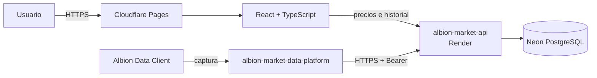

<div align="center">

# Albion Production Calculator

**Calculadora web de crafteo, retorno de materiales y análisis económico para Albion Online.**

[Usar Albion Calculator](https://albioncalculator.app/) · [Explorar guías](https://albioncalculator.app/guias) · [Analizar Black Market](https://albioncalculator.app/black-market) · [Documentación técnica](docs/)


</div>

---

Albion Production Calculator reúne costes de fabricación, retorno de recursos, tarifas, impuestos, fama, precios, historial y liquidez en una interfaz orientada a tomar decisiones antes de comprometer plata o transportar objetos.

> [!NOTE]
> El usuario final solo necesita abrir la aplicación web. Albion Data Client y el receiver local pertenecen al flujo de recolección de datos y no son necesarios para usar la calculadora.

## Probar el producto

| Recurso | Enlace |
|---|---|
| Calculadora de producción | [albioncalculator.app](https://albioncalculator.app/) |
| Black Market de Caerleon | [Comparar oportunidades](https://albioncalculator.app/black-market) |
| Centro de guías | [Guías de economía de Albion Online](https://albioncalculator.app/guias) |
| Rentabilidad de crafteo | [Fórmula, beneficio y ROI](https://albioncalculator.app/guias/rentabilidad-crafteo-albion-online) |
| Retorno de materiales | [RRR, foco y materiales devueltos](https://albioncalculator.app/guias/retorno-materiales-rrr-albion-online) |
| Black Market rentable | [Comprar o fabricar para Caerleon](https://albioncalculator.app/guias/black-market-caerleon-rentable) |

Los errores y propuestas pueden registrarse mediante [GitHub Issues](https://github.com/nachodev-ui/albion-production-calculator/issues).

## Capacidades principales

### Producción y rentabilidad

- costes de crafteo y refinamiento;
- retorno de recursos configurable;
- foco, Premium, bonos diarios y especialidad de ciudad;
- tarifas de estación, impuesto de venta y setup fee;
- materiales retornados y ahorro efectivo;
- beneficio, margen, ROI y precio objetivo.

### Mercado y liquidez

- precios actuales desde la API central;
- historial de 7 días y 4 semanas;
- compra de cada material en una ciudad diferente;
- ciudad de venta independiente;
- optimizador con señales de liquidez;
- análisis de oportunidades del Black Market;
- detección de datos insuficientes y valores atípicos.

### Fama y progresión

- fama base y bonificaciones de Premium;
- cálculo por cantidad fabricada;
- progreso de nivel y fama restante;
- selección de diarios compatibles;
- información contextual integrada en la interfaz.

## Arquitectura



La aplicación funciona con una arquitectura hosted-first:

```text
Usuario
→ https://albioncalculator.app
→ API central en Render
→ Neon PostgreSQL
```

La captura de datos opera por separado:

```text
Albion Data Client
→ albion-market-data-platform
→ albion-market-api
→ Neon PostgreSQL
```

## Stack tecnológico

| Capa | Tecnología |
|---|---|
| UI | React 19, TypeScript, Tailwind CSS |
| Estado | Zustand |
| Build | Vite 8 |
| Pruebas | Vitest |
| Contratos | OpenAPI, Redocly, openapi-typescript |
| Documentación | VitePress |
| Hosting | Cloudflare Pages |
| API | Go en Render |
| Datos | Neon PostgreSQL |

## Inicio rápido local

### Requisitos

- Node.js compatible con el lockfile;
- pnpm;
- API central local u hospedada.

### Instalación

```powershell
pnpm install
Copy-Item .env.example .env.local
pnpm dev
```

Configuración recomendada para desarrollo:

```dotenv
VITE_CENTRAL_MARKET_API_URL=http://127.0.0.1:8080/api/v1
VITE_ENABLE_LOCAL_RECEIVER_FALLBACK=false
VITE_MARKET_REQUEST_TIMEOUT_MS=7000
```

Configuración de producción:

```dotenv
VITE_CENTRAL_MARKET_API_URL=https://albion-market-api.onrender.com/api/v1
VITE_ENABLE_LOCAL_RECEIVER_FALLBACK=false
VITE_MARKET_REQUEST_TIMEOUT_MS=7000
```

> [!IMPORTANT]
> Las variables `VITE_*` forman parte del bundle público. Nunca deben contener tokens, contraseñas ni credenciales privadas.

## Estructura del repositorio

```text
.
├─ src/
│  ├─ app/                   routing, navegación y SEO
│  ├─ core/                  entidades y casos de uso
│  ├─ data/                  catálogo y repositorios
│  ├─ features/              módulos funcionales
│  └─ shared/                contratos, componentes y utilidades
├─ contracts/                OpenAPI de API central y receiver
├─ docs/                     documentación VitePress
├─ public/                   assets, sitemap y configuración pública
├─ scripts/                  dataset, SEO, seguridad y despliegue
└─ .github/workflows/        CI, producción e IndexNow
```

## Calidad y validación

```bash
pnpm contracts:check
pnpm security:check
pnpm test
pnpm lint
pnpm build
pnpm bundle:check
pnpm docs:build
```

La automatización cubre contratos OpenAPI, seguridad pública, reglas económicas, TypeScript, pruebas, build, presupuesto del bundle, documentos SEO, despliegue en Cloudflare y validación del recorrido Cloudflare → Render → Neon mediante Chromium.

## Producción y descubrimiento

La URL pública canónica es:

```text
https://albioncalculator.app/
```

Los despliegues de producción:

1. construyen y validan el frontend;
2. publican una revisión exacta en Cloudflare Pages;
3. verifican los bundles desde el dominio canónico;
4. comprueban API, Auth0 y readiness de Render;
5. validan precios reales mediante navegador;
6. notifican las URLs indexables mediante IndexNow.

## Documentación

| Tema | Enlace |
|---|---|
| Primeros pasos | [Guía de inicio](docs/getting-started.md) |
| Distribución | [Modelo hosted-first](docs/architecture/distribution-model.md) |
| Arquitectura | [Diseño de la aplicación](docs/architecture/overview.md) |
| Mercado | [Precios, historial y fallback](docs/architecture/market-data.md) |
| Cálculo | [Producción y rentabilidad](docs/features/calculation.md) |
| Análisis | [Mercado y liquidez](docs/features/market-analysis.md) |
| Operación | [Despliegue público](docs/operations/production-deployment.md) |
| Calidad | [Pruebas y rendimiento](docs/operations/testing.md) |

## Repositorios relacionados

| Repositorio | Función |
|---|---|
| [`albion-market-api`](https://github.com/nachodev-ui/albion-market-api) | API central de precios e historial |
| [`albion-market-data-platform`](https://github.com/nachodev-ui/albion-market-data-platform) | Receiver local, normalización y forwarder |

## Estado del proyecto

La aplicación está operativa en producción. El trabajo continúa en contenido educativo, calidad de datos, experiencia del usuario, observabilidad y releases estables.
